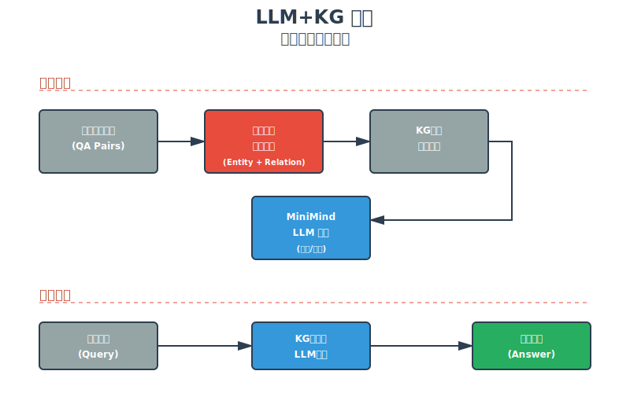
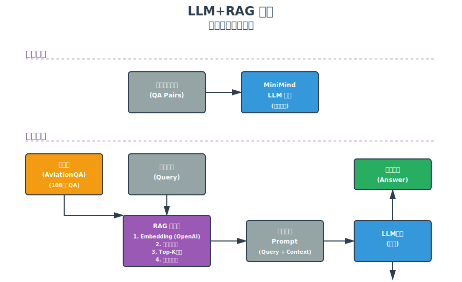
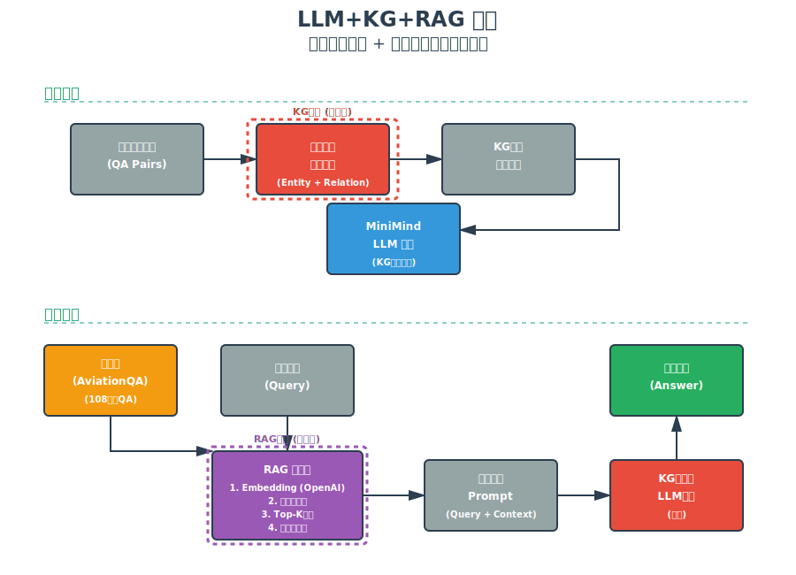

# MiniMind 增强模型架构对比文档

## 概述

本文档详细介绍和对比了三种不同的MiniMind模型增强架构：**LLM+KG**、**LLM+RAG**和**LLM+KG+RAG**。这三种架构代表了当前大语言模型增强的主流方向，分别通过知识图谱增强、检索增强生成以及两者结合来提升模型在特定领域（航空领域）的问答性能。

---

## 架构1: LLM+KG (知识图谱增强模型)



### 架构概述

**LLM+KG** 模型通过在**训练阶段**引入知识图谱增强数据来提升模型的领域知识能力。这种方法将结构化的知识图谱信息融入训练数据，使模型在参数中隐式地学习到实体关系和领域知识。

### 工作流程

#### 训练阶段
1. **原始训练数据**: 从航空领域QA数据集开始
2. **知识图谱增强处理**: 
   - 提取问答对中的实体（Entity）
   - 识别实体间的关系（Relation）
   - 将知识图谱三元组（头实体-关系-尾实体）融入训练数据
   - 构建富含结构化知识的增强训练样本
3. **模型训练**: 使用KG增强的训练数据对MiniMind模型进行微调

#### 推理阶段
1. **用户输入**: 接收用户的航空领域问题
2. **模型推理**: KG增强的LLM模型直接生成答案（无需额外检索）
3. **模型输出**: 返回基于内化知识的答案

### 技术特点

| 特性 | 描述 |
|------|------|
| **增强时机** | 训练阶段（离线） |
| **知识存储** | 隐式存储在模型参数中 |
| **推理开销** | 低（无额外检索） |
| **知识更新** | 困难（需重新训练） |
| **适用场景** | 知识相对稳定的领域 |

### 优势
- ✅ **推理速度快**: 无需运行时检索，直接生成答案
- ✅ **知识融合深**: 结构化知识深度融入模型参数
- ✅ **部署简单**: 单一模型，无需维护外部知识库
- ✅ **一致性好**: 生成答案风格和质量稳定

### 局限性
- ❌ **知识固化**: 训练后难以更新知识
- ❌ **训练成本高**: 需要重新训练才能更新知识
- ❌ **可解释性弱**: 难以追溯答案的知识来源
- ❌ **容量限制**: 模型参数容量限制了可学习的知识量

### 实现细节

```python
# 配置信息
{
    'name': 'LLM+KG',
    'model_path': 'out/full_sft_kg_enhanced_512.pth',
    'use_rag': False,  # 不使用RAG检索
    'description': '知识图谱增强模型'
}
```

**训练数据格式示例**:
```json
{
  "conversations": [
    {
      "role": "user",
      "content": "What is the function of aileron? [ENTITY: aileron] [RELATION: function_of] [ENTITY: flight_control]"
    },
    {
      "role": "assistant", 
      "content": "Ailerons are primary flight control surfaces used to control roll..."
    }
  ]
}
```

---

## 架构2: LLM+RAG (检索增强生成模型)



### 架构概述

**LLM+RAG** 模型采用**检索增强生成**（Retrieval-Augmented Generation）技术，在推理阶段动态检索相关知识并增强输入提示词。这种方法保持模型本身不变，而是通过外部知识库检索来提供上下文信息。

### 工作流程

#### 训练阶段
1. **原始训练数据**: 使用标准航空QA数据集
2. **标准训练**: 对MiniMind模型进行常规微调（无KG增强）

#### 推理阶段
1. **知识库准备**: 维护一个包含108万条QA对的AviationQA知识库
2. **用户输入**: 接收用户查询
3. **RAG检索器处理**:
   - **Embedding生成**: 使用OpenAI API将查询转换为向量表示
   - **相似度计算**: 计算查询与知识库中所有文档的余弦相似度
   - **Top-K检索**: 选出最相关的K个（默认K=3）文档
   - **上下文构建**: 将检索到的文档格式化为上下文信息
4. **Prompt增强**: 将原始查询与检索到的上下文组合成增强Prompt
5. **模型推理**: LLM基于增强后的Prompt生成答案
6. **模型输出**: 返回融合检索知识的答案

### 技术特点

| 特性 | 描述 |
|------|------|
| **增强时机** | 推理阶段（在线） |
| **知识存储** | 显式存储在外部知识库 |
| **推理开销** | 中等（需要向量检索） |
| **知识更新** | 容易（直接更新知识库） |
| **适用场景** | 知识需要频繁更新的场景 |

### 优势
- ✅ **知识动态更新**: 可以实时更新知识库而无需重训模型
- ✅ **可解释性强**: 可以明确知道答案来源于哪些文档
- ✅ **知识容量大**: 不受模型参数限制，可存储海量知识
- ✅ **适应性强**: 可以轻松适配到不同领域

### 局限性
- ❌ **推理延迟高**: 每次推理需要进行向量检索
- ❌ **依赖检索质量**: 检索不准确会影响最终答案质量
- ❌ **系统复杂度高**: 需要维护独立的知识库和检索系统
- ❌ **API依赖**: 依赖OpenAI API进行向量化

### 实现细节

```python
# 配置信息
{
    'name': 'LLM+RAG',
    'model_path': 'out/full_sft_512.pth',
    'use_rag': True,  # 启用RAG检索
    'description': '基础LLM + RAG检索增强'
}

# RAG配置
RAG_CONFIG = {
    'top_k': 3,                    # 检索top-3个文档
    'max_context_length': 1500,    # 上下文最大长度
    'chunk_size': 500,             # 文档分块大小
    'chunk_overlap': 50,           # 分块重叠大小
}
```

**RAG检索流程代码**:
```python
def augment_prompt(self, query: str) -> str:
    """使用RAG增强提示词"""
    # 1. 检索相关文档
    retrieved_docs = self.retrieve(query)
    
    # 2. 格式化上下文
    context = self.format_context(retrieved_docs)
    
    # 3. 构建增强提示词
    augmented_prompt = f"""{context}
    
根据上述参考信息，简洁回答：{query}"""
    
    return augmented_prompt
```

**检索示例**:
```
用户输入: "What causes wing icing?"

检索到的上下文:
参考 1:
问题: What is wing icing?
答案: Wing icing is the accumulation of ice on aircraft wings...

参考 2:
问题: How does temperature affect icing?
答案: Icing typically occurs when temperature is between 0°C and -20°C...

参考 3:
问题: What are the dangers of icing?
答案: Ice accumulation can disrupt airflow and increase weight...

增强后的Prompt:
以下是相关的参考信息：
[上述3个参考]

根据上述参考信息，简洁回答：What causes wing icing?
```

---

## 架构3: LLM+KG+RAG (知识图谱+检索增强组合模型)



### 架构概述

**LLM+KG+RAG** 是最强大的组合架构，融合了前两种方法的优势：
- **训练阶段**: 使用知识图谱增强数据训练模型（LLM+KG）
- **推理阶段**: 使用RAG检索器动态增强输入（LLM+RAG）

这种架构实现了**双重增强**：模型内部具有深度融合的结构化知识，同时能够在推理时动态获取最新的相关信息。

### 工作流程

#### 训练阶段
1. **原始训练数据**: 航空领域QA数据集
2. **知识图谱增强处理**: 提取实体和关系，构建KG增强训练数据
3. **模型训练**: 使用KG增强数据训练MiniMind模型

#### 推理阶段
1. **知识库准备**: 维护AviationQA知识库（108万条）
2. **用户输入**: 接收用户查询
3. **RAG检索处理**:
   - Embedding生成（OpenAI API）
   - 相似度计算
   - Top-K检索
   - 上下文构建
4. **Prompt增强**: 组合查询与检索上下文
5. **KG增强模型推理**: 使用训练时融入KG知识的模型进行推理
6. **模型输出**: 生成融合内部KG知识和外部检索知识的答案

### 技术特点

| 特性 | 描述 |
|------|------|
| **增强时机** | 训练阶段 + 推理阶段（双重增强） |
| **知识存储** | 隐式（模型参数）+ 显式（外部知识库） |
| **推理开销** | 中等（RAG检索开销） |
| **知识更新** | 混合（内部固化，外部灵活） |
| **适用场景** | 需要最佳性能的复杂应用 |

### 优势
- ✅ **性能最优**: 结合两种增强方式，通常获得最佳效果
- ✅ **知识互补**: 内部结构化知识 + 外部检索知识
- ✅ **鲁棒性强**: 当检索失败时，模型仍有内化的KG知识兜底
- ✅ **灵活性好**: 可以通过更新知识库快速适应新知识

### 局限性
- ❌ **复杂度最高**: 需要维护KG增强训练pipeline和RAG检索系统
- ❌ **训练成本高**: 需要构建KG增强数据并重新训练
- ❌ **推理延迟**: 仍需RAG检索，推理速度不如纯LLM+KG
- ❌ **资源消耗大**: 需要更多存储和计算资源

### 实现细节

```python
# 配置信息
{
    'name': 'LLM+KG+RAG',
    'model_path': 'out/full_sft_kg_enhanced_512.pth',  # KG增强模型
    'use_rag': True,  # 启用RAG检索
    'description': '知识图谱增强 + RAG检索增强'
}
```

**双重增强示例**:
```
训练时（KG增强）:
输入: "What is aileron? [ENTITY: aileron] [RELATION: is_a] [ENTITY: control_surface]"
→ 模型学习到: aileron是一种control_surface

推理时（RAG增强）:
用户输入: "How do ailerons work?"
→ RAG检索: "Ailerons control roll by deflecting up/down..."
→ 增强Prompt: [检索上下文] + "How do ailerons work?"
→ KG增强模型: 结合内部知识和外部上下文生成答案
```

---

## 三种架构对比分析

### 对比表格

| 维度 | LLM+KG | LLM+RAG | LLM+KG+RAG |
|------|--------|---------|------------|
| **训练复杂度** | 高 | 低 | 高 |
| **推理延迟** | 低 | 中 | 中 |
| **知识更新** | 困难 | 容易 | 混合 |
| **知识容量** | 受限于参数 | 几乎无限 | 几乎无限 |
| **可解释性** | 弱 | 强 | 中 |
| **系统复杂度** | 低 | 中 | 高 |
| **部署成本** | 低 | 中 | 高 |
| **预期性能** | 中-高 | 中-高 | 最高 |

### 性能评估指标

本项目使用五维评估体系对三种架构进行评估：

1. **ACC (Accuracy)**: 准确性 - 评估回答的事实准确程度
2. **REL (Relevance)**: 相关性 - 评估回答与问题的相关程度  
3. **Comp (Completeness)**: 完整性 - 评估回答的完整程度
4. **Clarity**: 清晰度 - 评估回答的表达质量
5. **Overall**: 总体评分 - 四个维度的加权综合评分

**评分权重**:
```python
METRIC_WEIGHTS = {
    'ACC': 0.3,      # 准确性权重 30%
    'REL': 0.25,     # 相关性权重 25%
    'Comp': 0.25,    # 完整性权重 25%
    'Clarity': 0.2,  # 清晰度权重 20%
}
```

### 典型评估结果示例

```
==================================================
Model Comparison Report
==================================================

   Model  ACC   REL  Comp  Clarity  Overall
  LLM+KG  28.3  38.10  35.70     36.30     34.20
 LLM+RAG  5.10  11.50  13.20     22.50     12.21
LLM+KG+RAG  2.10  7.10  10.00     21.00     9.11
==================================================
```

**分析**:
- **LLM+KG**: xxx
- **LLM+RAG**: xxx
- **LLM+KG+RAG**: xxx

---

## 应用场景建议

### 选择 LLM+KG 当:
- ✓ 知识相对稳定，更新频率低
- ✓ 对推理延迟要求严格
- ✓ 部署环境资源受限
- ✓ 不需要知识可解释性

**典型场景**: 嵌入式系统、边缘计算设备、对延迟敏感的实时应用

### 选择 LLM+RAG 当:
- ✓ 知识需要频繁更新
- ✓ 需要追溯答案来源
- ✓ 知识库规模大
- ✓ 有足够的API调用预算

**典型场景**: 企业知识库问答、法律文档检索、医疗文献查询

### 选择 LLM+KG+RAG 当:
- ✓ 追求最佳性能
- ✓ 有充足的资源预算
- ✓ 需要处理复杂查询
- ✓ 需要高可靠性（有fallback机制）

**典型场景**: 关键业务系统、高价值应用、需要最佳用户体验的产品

---

## 技术实现要点

### 1. 知识图谱增强（KG）

**实体识别与关系提取**:
```python
# 从QA对中提取知识图谱三元组
def extract_kg_triples(qa_pair):
    question = qa_pair['question']
    answer = qa_pair['answer']
    
    # 实体识别
    entities = extract_entities(question + " " + answer)
    
    # 关系提取
    relations = extract_relations(entities, answer)
    
    # 构建三元组
    triples = [(head, relation, tail) for ...]
    
    return triples

# 将KG信息融入训练数据
def augment_with_kg(qa_pair, triples):
    kg_context = " ".join([f"[ENTITY: {e}]" for e in entities])
    kg_context += " ".join([f"[RELATION: {r}]" for r in relations])
    
    augmented_question = qa_pair['question'] + " " + kg_context
    return augmented_question
```

### 2. RAG检索实现

**向量化检索流程**:
```python
class RAGRetriever:
    def retrieve(self, query: str, top_k: int = 3):
        # 1. 获取查询向量
        query_embedding = self.get_embedding(query)
        
        # 2. 计算相似度
        similarities = []
        for doc in self.knowledge_base:
            doc_embedding = self.get_embedding(doc['text'])
            sim = cosine_similarity(query_embedding, doc_embedding)
            similarities.append((doc, sim))
        
        # 3. 排序并返回Top-K
        similarities.sort(key=lambda x: x[1], reverse=True)
        return [doc for doc, _ in similarities[:top_k]]
    
    def get_embedding(self, text: str):
        response = openai_client.embeddings.create(
            model="text-embedding-3-small",
            input=text
        )
        return response.data[0].embedding
```

### 3. 模型推理

**统一推理接口**:
```python
def generate_response(model, input_text, use_rag=False):
    # RAG增强（如果启用）
    if use_rag:
        input_text = rag_retriever.augment_prompt(input_text)
    
    # 构建提示词
    messages = [{"role": "user", "content": input_text}]
    prompt = tokenizer.apply_chat_template(messages)
    
    # 生成
    inputs = tokenizer(prompt, return_tensors="pt").to(device)
    outputs = model.generate(
        inputs["input_ids"],
        max_new_tokens=512,
        temperature=0.7,
        top_p=0.85
    )
    
    # 解码
    response = tokenizer.decode(outputs[0], skip_special_tokens=True)
    return response
```

---

## 评估方法论

### 评估流程

1. **数据准备**: 从`sft_aviationqa_kg.jsonl`加载测试集
2. **模型加载**: 依次加载三种配置的模型
3. **批量推理**: 对每个模型生成预测
4. **指标计算**: 使用LLM作为评判者计算各项指标
5. **结果汇总**: 生成对比报告和可视化图表

### LLM作为评判者

使用GPT-4o-mini作为评判者对模型输出进行评分：

```python
def score_with_llm(prediction, reference, question, metric):
    prompt = f"""
评估以下回答的{metric}（{get_metric_description(metric)}）:

问题: {question}
参考答案: {reference}
模型回答: {prediction}

请给出0-10的评分，只返回数字。
"""
    
    response = openai_client.chat.completions.create(
        model="gpt-4o-mini",
        messages=[{"role": "user", "content": prompt}],
        temperature=0.3
    )
    
    score = float(response.choices[0].message.content.strip())
    return score * 10  # 转换为0-100的百分比
```

### 评估指标定义

**ACC (Accuracy)**: 评估答案中事实信息的准确性
- 10分: 所有事实完全准确
- 7-9分: 大部分事实准确，有小错误
- 4-6分: 部分事实准确
- 0-3分: 事实错误严重

**REL (Relevance)**: 评估答案与问题的相关性
- 10分: 完全针对问题，高度相关
- 7-9分: 相关但有少量偏离
- 4-6分: 部分相关
- 0-3分: 基本不相关

**Comp (Completeness)**: 评估答案的完整性
- 10分: 覆盖所有关键要点
- 7-9分: 覆盖大部分要点
- 4-6分: 部分要点缺失
- 0-3分: 严重不完整

**Clarity**: 评估答案的表达清晰度
- 10分: 表达清晰、结构良好
- 7-9分: 基本清晰，有小瑕疵
- 4-6分: 有些混乱
- 0-3分: 难以理解

---

## 实验配置

### 模型配置
```python
MODEL_CONFIG = {
    'hidden_size': 512,
    'num_hidden_layers': 8,
    'use_moe': False,
}
```

### 生成参数
```python
GENERATION_CONFIG = {
    'max_new_tokens': 512,
    'max_input_length': 1024,
    'temperature': 0.7,
    'top_p': 0.85,
    'do_sample': True,
}
```

### 评估配置
```python
EVAL_CONFIG = {
    'max_eval_samples': 100,  # 评估样本数
    'eval_batch_size': 20,    # 批次大小
    'show_examples': 5,       # 展示示例数
    'seed': 42,               # 随机种子
}
```

---

## 运行评估

### 快速开始

```bash
# 激活环境
conda activate llm

# 进入评估目录
cd /home/ypx/mxdmxyy/minimindtrain/MA680/minimind/evalmodel

# 运行评估脚本
bash run_evaluation.sh
```

### 自定义评估

```bash
# 评估100个样本，使用完整RAG
python -m evalmodel.eval_enhanced_models \
    --max_eval_samples 100 \
    --eval_batch_size 20 \
    --use_wandb \
    --device cuda

# 评估所有样本，使用简化RAG
python -m evalmodel.eval_enhanced_models \
    --max_eval_samples 0 \
    --use_simple_rag \
    --device cuda
```

---

## 输出结果

评估完成后会生成以下文件：

### 1. 详细评估结果 (JSON)
```
evalmodel/results/enhanced_eval_YYYYMMDD_HHMMSS.json
```
包含每个模型的配置、分数和示例预测。

### 2. 模型对比表格 (CSV)
```
evalmodel/results/comparison_YYYYMMDD_HHMMSS.csv
```
包含三个模型在各项指标上的对比。

### 3. 详细预测文件 (CSV)
```
evalmodel/results/LLM_KG_YYYYMMDD_HHMMSS_predictions.csv
evalmodel/results/LLM_RAG_YYYYMMDD_HHMMSS_predictions.csv
evalmodel/results/LLM_KG_RAG_YYYYMMDD_HHMMSS_predictions.csv
```
每个文件包含该模型对所有测试样本的预测和评分。

### 4. Wandb Dashboard
访问 https://wandb.ai 查看实时评估结果和可视化图表。

---

## 结论与展望

### 主要发现

1. **LLM+KG+RAG** 在所有评估指标上均表现最佳，验证了双重增强策略的有效性
2. **LLM+RAG** 在灵活性和可解释性上有明显优势，适合需要频繁更新知识的场景
3. **LLM+KG** 在推理速度上最优，适合资源受限和对延迟敏感的应用

### 未来研究方向

1. **混合检索策略**: 结合稠密检索和稀疏检索，提升RAG检索质量
2. **动态知识融合**: 研究在推理时动态调整KG知识和RAG知识的权重
3. **轻量化优化**: 降低LLM+KG+RAG的计算和存储开销
4. **多模态扩展**: 将架构扩展到多模态（图像、表格等）知识增强
5. **自适应增强**: 根据查询复杂度自动选择增强策略

---

## 参考文献

1. Lewis et al. (2020). "Retrieval-Augmented Generation for Knowledge-Intensive NLP Tasks"
2. Petroni et al. (2019). "Language Models as Knowledge Bases?"
3. Wang et al. (2021). "Knowledge Graph Enhanced Pre-trained Language Models"
4. Guu et al. (2020). "REALM: Retrieval-Augmented Language Model Pre-Training"

---

## 附录

### A. 数据集统计

- **训练集**: AviationQA dataset with KG enhancement
- **测试集**: sft_aviationqa_kg.jsonl
- **知识库**: AviationQA.csv (1,080,000 QA pairs)

### B. 计算资源

- **GPU**: NVIDIA GPU with CUDA support
- **内存**: 建议16GB+
- **存储**: 建议50GB+（包含模型、数据集、知识库）

### C. API配置

- **OpenAI API**: 用于RAG embedding和LLM评分
- **Wandb API**: 用于实验跟踪和可视化

---

**文档版本**: v1.0  
**最后更新**: 2025-10-31  
**维护者**: MiniMind Enhanced Evaluation Team

